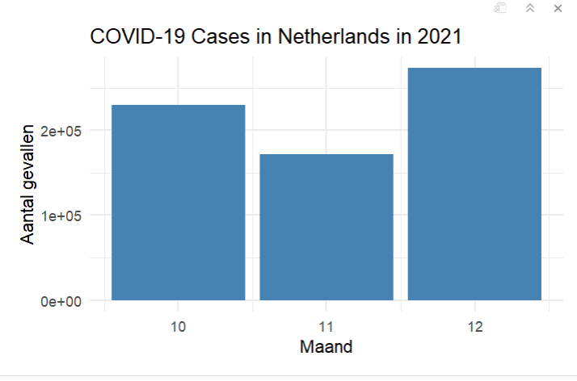

```{r, libraries laden}
library(dplyr)
library(ggplot2)
library(httr)
```

# COVID-19 rapport

```{r eval=FALSE, include=TRUE}
process_covid_data <- function(country, years, months) {

url <- "https://opendata.ecdc.europa.eu/covid19/nationalcasedeath_eueea_daily_ei/csv"
response <- httr::GET(url)

if (httr::status_code(response) != 200) {
stop("Failed to fetch COVID-19 data.")
}

raw_data <- read.csv(
text = httr::content(response, "text"),
stringsAsFactors = FALSE
)

# Zorg dat year en month numeriek zijn

raw_data$year  <- as.numeric(raw_data$year)
raw_data$month <- as.numeric(raw_data$month)

processed_data <- raw_data %>%
filter(
countriesAndTerritories == country,
year %in% years,
month %in% months
)

if (nrow(processed_data) == 0) {
stop("No data found for selected parameters.")
}

return(processed_data)
}

```

```{r eval=FALSE, include=TRUE}
covid_data <- process_covid_data(
country = params$country,
years = params$year,
months = params$months
)
```


```{r eval=FALSE, include=TRUE}
ggplot(covid_data, aes(x = month, y = cases)) +
geom_col (fill = "steelblue") +
labs(
title = paste("COVID-19 Cases in", params$country, "in", params$year),
x = "Maand",
y = "Aantal gevallen"
) +
theme_minimal()
```


```{r eval=FALSE, include=TRUE}
ggplot(covid_data, aes(x = month, y = deaths)) +
geom_col(fill = "steelblue") +
labs(
title = paste("COVID-19 Deaths in", params$country, "in", params$year),
x = "Maand",
y = "Aantal sterfgevallen"
) +
theme_minimal()
```

## Bewijs dat het werkt:
```{r eval=FALSE, include=TRUE}
covid_data <- process_covid_data(
  country = "Netherlands",
  years   = 2020,
  months  = c(10, 11, 12)
)
```




